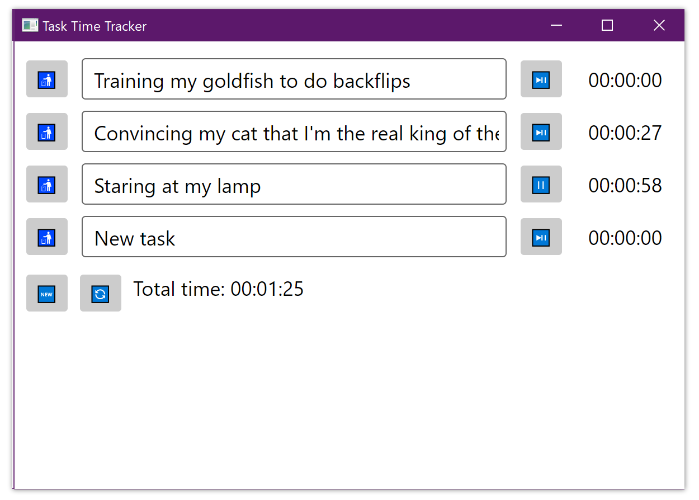

# Task Time Tracker in F#

A simple time-tracking tool. Works fine on Windows, but on macOS... not so much.

## Information

This project was an attempt to create a UI using F#. I have to say, it has been a truly terrible and frustrating experience. While I did manage to put together a basic application, it was far from easy.

Back when we were just starting to learn programming in our first semester of IT studies, we could build similar UIs effortlessly using Windows.Forms and a GUI editor in Visual Studio. It was simple and straightforward. Now, making a UI feels like pure suffering.

## Contribution

On macOS, the program crashes after running for a while, but honestly, I have no interest in debugging it. If someone feels like tackling this issue, go for it! I'll buy a good craft beer for whoever fixes the bug. As for me, I'm done with it.

## License

This project is released under the [Unlicense](LICENSE) license.
